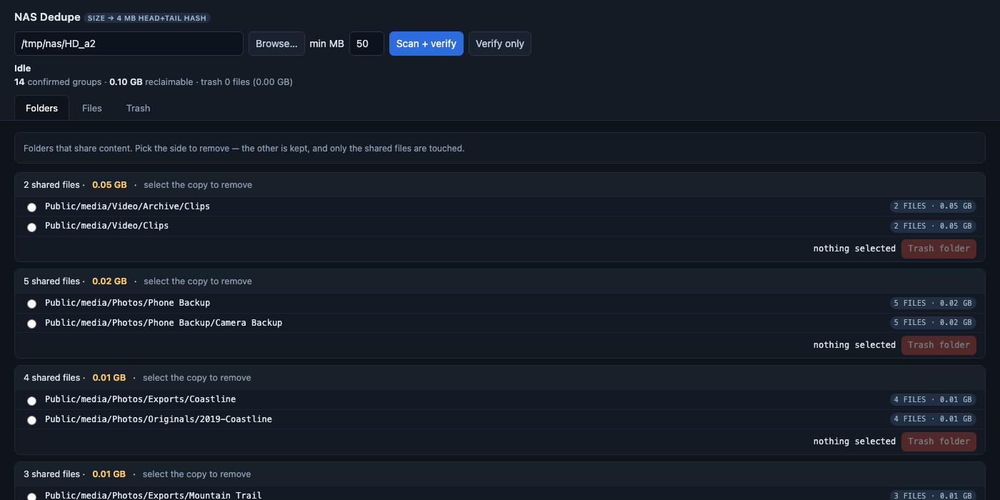
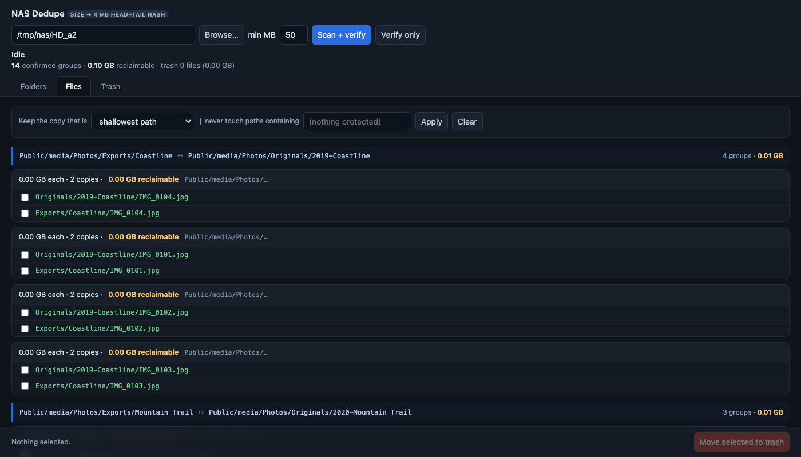
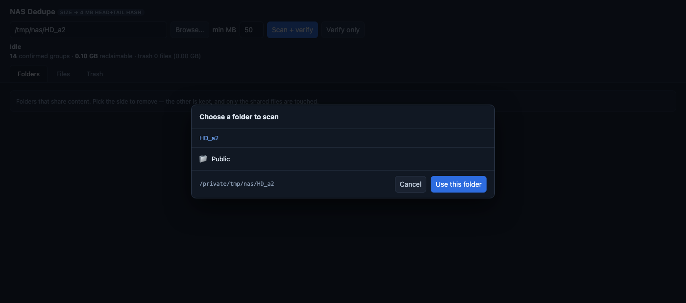

# WD FileDeduper

A duplicate-file finder that runs **on** a WD My Cloud EX2 Ultra (OS 5), not over
SMB. Registers as a native app on the dashboard **Apps** page, same trick as
[WD FileBrowser App](../WD%20FileBrowser%20App) — no signed `.bin` upload needed.

Tested on firmware **5.33.102**, `armv7l`, Python **3.9.2**.



## Why it exists

No prebuilt dedupe tool ships for armv7: fclones is x86-only, Czkawka is arm64-only,
jdupes and rmlint publish no binaries. The NAS has no gcc and no package manager, so
cross-compiling was out. `dedupe.py` is **stdlib only** — `sqlite3`, `hashlib`,
`http.server`, nothing to install.

## How it finds duplicates without thrashing the disk

Scanning 2.4 TB with full-file hashes takes ~10 hours and is disk-bound. This uses a
three-stage funnel instead:

1. **Group by exact byte size** — metadata only, zero file reads.
2. **Hash first 4 MB + last 4 MB** (md5) for size collisions only.
3. **Never full-file hash.**

Groups where every entry shares one inode are hardlinks, not duplicates, and are
excluded (`COUNT(DISTINCT ino) > 1`).

Paths are stored as `BLOB` so non-UTF8 filenames survive the round trip.

### Known false positives

Stage 2 matches a prefix and a suffix, not the middle. Three classes of file collide
legitimately — check before deleting:

- **DVD `.VOB` chunks** — exactly 1.00 GB each by authoring spec.
- **TV episodes from one encode batch** — same encoder settings, same size.
- **Old XviD rips** — all padded to fit a 700 MB CD.

## The UI

Three tabs on `:8090`, behind an HTTP Basic login:

- **Folders** — duplicate folder *pairs*, picked with a radio button per side.
  One row per pair, not one per file: 213 shared files is a single decision, not 213.
- **Files** — duplicate groups, collapsed by the folder pair they span.
- **Trash** — everything staged, restorable.



**Browse…** picks the scan root, so you never hand-type a path:



Browsing is confined to the mounted data volumes — `_confined()` resolves symlinks
first, so the picker can't be walked out of `/mnt/HD/HD_*2` into the rest of the
filesystem now that the app is on the LAN. The current tab and the picker live in
`location.hash`, so a reload puts you back where you were.

Selection rules borrowed from paid dedupers (Duplicate Cleaner's Selection Assistant,
Gemini 2's Smart Select): keep shallowest/deepest path, keep newest/oldest, keep the
copy inside a chosen folder, plus a protected-path filter.

Deletion is **two-stage and reversible**: files are `os.rename`d into `app/trash/`
(same filesystem, so it is instant and copies nothing) and only leave the disk when
you empty the trash. Restore puts them back *and* re-indexes them.

The keep-one guard is computed server-side from the group's own rows, not from the
client payload — the UI cannot be coaxed into deleting every copy. Each file is
re-`lstat`ed and re-hashed immediately before it moves.

## Roadmap

Next five features — and two things deliberately not being built — are in
[ROADMAP.md](ROADMAP.md).

## Files (`app/`)

| File | Purpose |
|------|---------|
| `dedupe.py` | The whole app — scanner, sqlite index, HTTP server, embedded UI |
| `apkg.xml` | App manifest the dashboard reads (name, port 8090, icon) |
| `apkg.rc` | WD package metadata |
| `start.sh` | Start hook — pidfile-based, resolves `python3` by absolute path |
| `stop.sh` | Stop hook |
| `init.sh` | Install hook (no-op; stdlib only, nothing to link) |
| `remove.sh` | Uninstall hook — stops app, removes monit watch, drops registry item |
| `clean.sh` | Post-remove hook (no-op) |
| `dedupe.png` | Dashboard tile icon |
| `setpw.sh` | Set the password from stdin and restart |
| `dedupe.auth` | Generated at install — `user:salt:pbkdf2`, mode 600, never committed |
| `monit.dedupe.conf` | monit watch → boot-start + crash-restart |

## Install (on the NAS, over SSH)

```bash
NAS=sshd@<nas-ip>        # your NAS SSH user@ip
scp -r app "$NAS":/tmp/dedupe-app
ssh "$NAS" 'sh /tmp/dedupe-app/install.sh'
```

The installer generates a random password on first run and **prints it once**:

```
  =============================================
   File Deduper login  (shown once - save it)
     user:     admin
     password: <generated>
  =============================================
```

Then open `http://<nas-ip>:8090` and log in.

Re-running the installer is safe: it stops the app, replaces only its own files, and
leaves `dedupe.db`, `trash/` and `dedupe.auth` untouched.

To choose your own password:

```bash
ssh "$NAS" "printf 'newpassword' | sh /mnt/HD/HD_a2/Nas_Prog/dedupe/setpw.sh"
```

`setpw.sh` takes the password on stdin, not in `argv`, so it never appears in `ps`.
It rehashes with a fresh salt and restarts the app to drop the cached header. Pass a
username as `$1` to change that too. Deleting `dedupe.auth` and re-running the
installer generates a random password instead.

## Uninstall

```bash
ssh "$NAS" 'sh /mnt/HD/HD_a2/Nas_Prog/dedupe/remove.sh'
```

`dedupe.db` and `trash/` are left behind on purpose. **Empty the trash from the UI
before uninstalling** if you want that space back.

## Caveats

- **Auth is HTTP Basic over plain HTTP.** Credentials are base64, not encrypted, so
  anyone sniffing your LAN can read them. That is an accepted trade for a home NAS on
  a trusted network — do not port-forward this to the internet.
- **`dedupe.py` refuses to bind anything but localhost when `dedupe.auth` is missing
  or malformed.** The app exposes `/api/trash` and `/api/empty` — mass delete — so the
  interlock makes "exposed with no password" unreachable by accident, including after
  a botched reinstall. Set `DEDUPE_HOST=127.0.0.1` in `start.sh` to go back to
  tunnel-only access (`ssh -N -L 8090:127.0.0.1:8090 <user>@<nas>`).
- **The password is stored as PBKDF2-SHA256** (50k rounds, 16-byte salt) in
  `dedupe.auth`, mode `600`. Verified `Authorization` headers are cached in memory,
  because a 50k-round derivation costs ~0.3 s on armv7 and the UI polls every 1.3 s.
- **`pgrep -f` / `pkill -f` are unusable here** — the pattern matches the calling
  script's own command line, so `start.sh` reports a false "already running" and
  `pkill` kills the SSH session. Both hooks use a pidfile instead.
- **HTTP/1.0 + `Connection: close`** is deliberate. Keep-alive leaves stale sockets
  behind an SSH tunnel and POSTs die with `ERR_CONNECTION_RESET`.
- **No native `confirm()`/`alert()`** — suppressed silently in some browser contexts.
  Destructive buttons use a two-step in-page arm/confirm.
- **Firmware updates** (not normal reboots) wipe the registry entry and the monit
  conf, since both live on the firmware partition. Re-run the installer afterwards.
  The app directory under `Nas_Prog` is on the data volume and survives.
